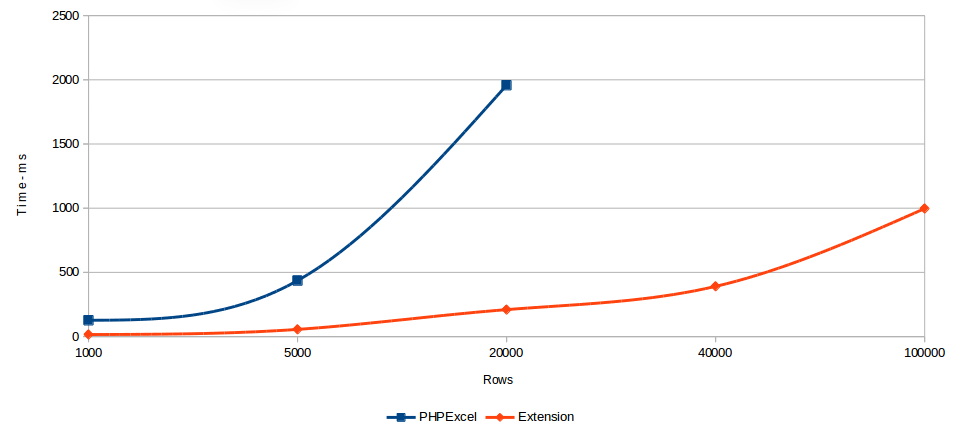

<div align=center>

</div>

<div align=center>
<a href="https://github.com/viest/php-ext-xlswriter/releases"></a>
</div>

<div align=center>
<a href="https://github.com/viest/php-ext-xlswriter"></a>
</div>

<div align=center>
<a href="https://travis-ci.com/viest/php-ext-xlswriter"></a>
<a href="https://ci.appveyor.com/project/viest/php-ext-excel-export/branch/master"></a>
<a href="https://app.fossa.io/projects/git%2Bgithub.com%2Fviest%2Fphp-ext-xlswriter?ref=badge_shield"></a>
</div>

<div align=center>
<a href="https://opencollective.com/php-ext-xlswriter"></a>
<a href="https://github.com/viest/php-ext-xlswriter"></a>
<a href="https://github.com/viest/php-ext-xlswriter"></a>
<a href="https://github.com/viest/php-ext-xlswriter"></a>
<a href="https://github.com/viest/php-ext-xlswriter"></a>
<a href="https://hits.seeyoufarm.com"></a>
</div>

## Why use xlswriter

Please refer to the image below. PHPExcel has been unable to work properly for memory reasons at 40,000 and 100000 points, but it can be resolved by modifying the ini configuration, but the time may take longer to complete the work;



xlswriter is a PHP C Extension that can be used to write text, numbers, formulas and hyperlinks to multiple worksheets in an Excel 2007+ XLSX file. It supports features such as:

###### Writer

* 100% compatible Excel XLSX files.
* Full Excel formatting.
* Merged cells.
* Defined names.
* Autofilters.
* Charts.
* Data validation and drop down lists.
* Worksheet PNG/JPEG images.
* Memory optimization mode for writing large files.
* Works on Linux, FreeBSD, OpenBSD, OS X, Windows.
* Compiles for 32 and 64 bit.
* FreeBSD License.
* The only dependency is on zlib.

###### Reader

* Full read data
* Cursor read data
* Read by data type

#### Install

###### Unix

```bash
pecl install xlswriter
```

###### Windows

[download dll](https://github.com/viest/php-ext-xlswriter/releases)

#### Benchmark

Test environment: Macbook Pro 13 inch, Intel Core i5, 16GB 2133MHz LPDDR3 Memory, 128GB SSD Storage.

##### Export

> Two memory modes export 1 million rows of data (27 columns, data is string)

* Normal mode: only 29S is needed, and the memory only needs 2083MB;
* Fixed memory mode: only need 52S, memory only needs <1MB;

##### Import

> 1 million rows of data (1 columns, data is inter)

* Full mode: Just 3S, the memory is only 558MB;
* Cursor mode: Just 2.8S, memory is only <1MB;

## [Documents](https://xlswriter-docs.viest.me/)

Includes extensive and detailed instructions that make it easy to get started with xlswriter.

## PECL Repository

[](https://pecl.php.net/package/xlswriter)

## IDE Helper

```bash
composer require viest/php-ext-xlswriter-ide-helper:dev-master
```

## Exchange group


## Financial donation


## Contributors

### Code Contributors

This project exists thanks to all the people who contribute. [[Contribute](CONTRIBUTING.md)].
<a href="https://github.com/viest/php-ext-xlswriter/graphs/contributors"></a>

### Financial Contributors

Become a financial contributor and help us sustain our community. [[Contribute](https://opencollective.com/php-ext-xlswriter/contribute)]

#### Individuals

<a href="https://opencollective.com/php-ext-xlswriter"></a>

#### Organizations

Support this project with your organization. Your logo will show up here with a link to your website. [[Contribute](https://opencollective.com/php-ext-xlswriter/contribute)]

<a href="https://opencollective.com/php-ext-xlswriter/organization/0/website"></a>
<a href="https://opencollective.com/php-ext-xlswriter/organization/1/website"></a>
<a href="https://opencollective.com/php-ext-xlswriter/organization/2/website"></a>
<a href="https://opencollective.com/php-ext-xlswriter/organization/3/website"></a>
<a href="https://opencollective.com/php-ext-xlswriter/organization/4/website"></a>
<a href="https://opencollective.com/php-ext-xlswriter/organization/5/website"></a>
<a href="https://opencollective.com/php-ext-xlswriter/organization/6/website"></a>
<a href="https://opencollective.com/php-ext-xlswriter/organization/7/website"></a>
<a href="https://opencollective.com/php-ext-xlswriter/organization/8/website"></a>
<a href="https://opencollective.com/php-ext-xlswriter/organization/9/website"></a>

## License

BSD License

[](https://app.fossa.io/projects/git%2Bgithub.com%2Fviest%2Fphp-ext-xlswriter?ref=badge_large)

## Stargazers over time

[](https://starchart.cc/viest/php-ext-xlswriter)
