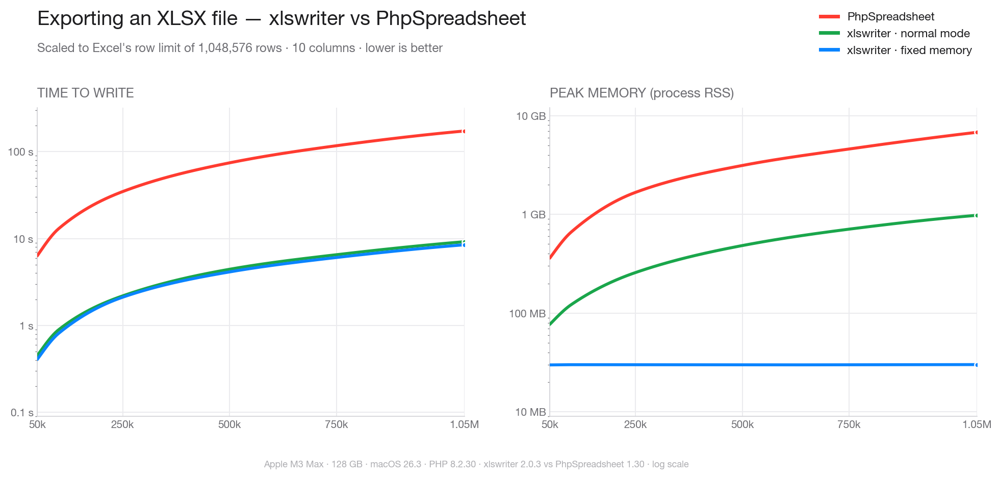

<div align=center>

</div>

<div align=center>
<a href="https://github.com/viest/php-ext-xlswriter/releases"></a>
</div>

<div align=center>
<a href="https://github.com/viest/php-ext-xlswriter"></a>
</div>

<div align=center>
<a href="https://gitee.com/viest/php-ext-xlswriter"></a>
<a href="https://gitcode.com/viest/php-ext-xlsxwriter"></a>
</div>

<div align=center>
<a href="https://github.com/viest/php-ext-xlswriter/actions"></a>
<a href="https://ci.appveyor.com/project/viest/php-ext-xlswriter/branch/master"></a>
<a href="https://app.fossa.io/projects/git%2Bgithub.com%2Fviest%2Fphp-ext-xlswriter?ref=badge_shield"></a>
</div>

<div align=center>
<a href="https://opencollective.com/php-ext-xlswriter"></a>
<a href="https://github.com/viest/php-ext-xlswriter"></a>
<a href="https://github.com/viest/php-ext-xlswriter"></a>
<a href="https://github.com/viest/php-ext-xlswriter"></a>
<a href="https://github.com/viest/php-ext-xlswriter"></a>
</div>

## 为什么使用xlswriter

下图对比了 xlswriter 与 PhpSpreadsheet（PHPExcel 的官方后续项目）导出 XLSX 的性能，数据量一直放大到 Excel 的行数上限。以 1,048,576 行 × 10 列为例，xlswriter 快约 20 倍；其固定内存模式无论写入多少行，峰值内存都稳定在约 30 MB，而纯 PHP 库的内存会随数据量持续增长（同一个文件约需 7 GB）。



> 两种 xlswriter 模式的耗时相差约 10% 以内。固定内存模式之所以略快，是因为它把每一行直接流式写入磁盘并立即释放——单趟完成，不需要在内存里先建好整个工作表、最后再二次序列化。代价是：与普通模式不同，单元格一旦写出就无法再回头修改（且字符串以内联方式存储、不做去重，文件可能略大）。普通模式会把整个工作簿保留在内存中，正因如此你才能以任意顺序写入单元格、并在保存前重新设置样式。

xlswriter 是一个 PHP C 扩展，用于处理 Excel 2007+ XLSX 文件：向新文件写入文本、数字、公式、日期、图表、图片和超链接，打开已有文件进行编辑并保存结果，读取文件内容，以及将公式求值为计算结果。

它具备以下特性：

###### 一、写入

* 100％兼容的Excel XLSX文件
* 完整的Excel格式
* 合并单元格
* 定义工作表名称
* 过滤器
* 图表
* 数据验证和下拉列表
* 条件格式
* 富文本、批注与超链接
* 工作表PNG/JPEG图像
* 编辑已有文件——打开文件后修改单元格的值、样式、合并区域与行列尺寸，新增工作表、图片和图表，再保存结果
* 公式计算——对公式求值得到计算结果，也可在写入公式时附带预先算好的缓存值
* 用于写入大文件的内存优化模式
* 适用于Linux，FreeBSD，OpenBSD，OS X，Windows
* 编译为32位和64位
* FreeBSD许可证
* 唯一的依赖是zlib（编译期需要其开发头文件：Alpine `apk add zlib-dev`、Debian/Ubuntu `apt-get install zlib1g-dev`、RHEL/CentOS `yum install zlib-devel`）

###### 二、读取

* 完整读取与游标读取
* 按数据类型读取
* 读取单元格样式与数字格式
* 读取合并单元格
* 读取图片、图表与批注
* 读取公式及其缓存值

#### 基准测试

测试环境: Macbook Pro 13 inch, Intel Core i5, 16GB 2133MHz LPDDR3 Memory, 128GB SSD Storage.

##### 导出

> 两种内存模式导出100万行数据（单行27列，数据类型均为字符串，单个字符串长度为19）

* 普通模式：耗时 `29S`，内存只需 `2083MB`；
* 固定内存模式：仅需 `52S`，内存仅需 `<1MB`；

##### 导入

> 100万行数据（单行1列，数据类型为INT）

* 全量模式：耗时 `3S`，内存仅 `558MB`；
* 游标模式：耗时 `2.8S`，内存仅 `<1MB`；

## 从这里开始

[文档|Documents](https://xlswriter-docs.viest.me/)

## PECL 仓库

[](https://pecl.php.net/package/xlswriter)

## IDE Helper

```bash
composer require viest/php-ext-xlswriter-ide-helper:dev-master
```

## 交流群


## 贡献者

### 代码贡献者

这个项目的存在要感谢所有贡献者。 [[Contribute](CONTRIBUTING.md)].
<a href="https://github.com/viest/php-ext-xlswriter/graphs/contributors"></a>

### 财务捐赠者

成为财务捐赠者，并帮助我们维持我们的社区。[[Contribute](https://opencollective.com/php-ext-xlswriter/contribute)]

#### 个人

<a href="https://opencollective.com/php-ext-xlswriter"></a>

#### 组织机构

与您的组织一起支持该项目。您的徽标将显示在此处，并带有指向您网站的链接。[[Contribute](https://opencollective.com/php-ext-xlswriter/contribute)]

<a href="https://opencollective.com/php-ext-xlswriter/organization/0/website"></a>
<a href="https://opencollective.com/php-ext-xlswriter/organization/1/website"></a>
<a href="https://opencollective.com/php-ext-xlswriter/organization/2/website"></a>
<a href="https://opencollective.com/php-ext-xlswriter/organization/3/website"></a>
<a href="https://opencollective.com/php-ext-xlswriter/organization/4/website"></a>
<a href="https://opencollective.com/php-ext-xlswriter/organization/5/website"></a>
<a href="https://opencollective.com/php-ext-xlswriter/organization/6/website"></a>
<a href="https://opencollective.com/php-ext-xlswriter/organization/7/website"></a>
<a href="https://opencollective.com/php-ext-xlswriter/organization/8/website"></a>
<a href="https://opencollective.com/php-ext-xlswriter/organization/9/website"></a>


## License

BSD license

[](https://app.fossa.io/projects/git%2Bgithub.com%2Fviest%2Fphp-ext-xlswriter?ref=badge_large)

## Stargazers over time

[](https://starchart.cc/viest/php-ext-xlswriter)
