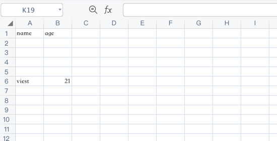

# 设置当前写入行号

设置行号可实现从某行开始写入数据，行号从0开始递增，0表示第一行，1表示第二行，2表示第三行。

```php
$config = [
    'path' => './tests'
];

$fileObject = new \Vtiful\Kernel\Excel($config);

$fileObject->fileName('tutorial.xlsx')
    ->header(['name', 'age'])
    ->setCurrentLine(6) // 从第六行开始写入数据
    ->data([
        ['viest', 21],
    ]);
```

