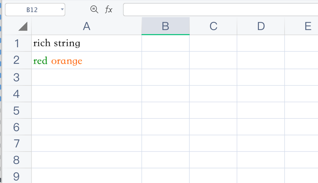

# 多样式文字

## 示例

```php
$config = [
    'path' => './tests'
];

$fileObject = new \Vtiful\Kernel\Excel($config);

$fileObject = $fileObject->fileName("rich_string.xlsx")
    ->header(['rich string']);

$fileHandle = $fileObject->getHandle();

// 创建红色字符样式
$format1  = new \Vtiful\Kernel\Format($fileHandle);
$colorRed = $format1->fontColor(\Vtiful\Kernel\Format::COLOR_GREEN)->toResource();

// 创建橙色字符样式
$format2     = new \Vtiful\Kernel\Format($fileHandle);
$colorOrange = $format2->fontColor(\Vtiful\Kernel\Format::COLOR_ORANGE)->toResource();

// 创建红色文字
$richStringOne = new \Vtiful\Kernel\RichString('red ', $colorRed);

// 创建橙色文字
$richStringTwo = new \Vtiful\Kernel\RichString('orange', $colorOrange);

// 将 红色文字 与 橙色文字 写入单元格
$fileObject->insertRichText(1, 0, [
    $richStringOne,
    $richStringTwo
]);

$filePath = $fileObject->output();
```


