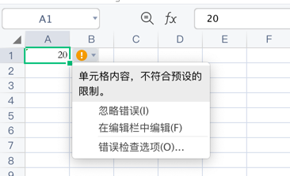

# 范围约束

## 自定义范围值

### 示例

单元格数据验证类型为`整数`，约束条件为`范围`，最小值为`1`，最大值为`10`。所以单元格`A1`的值必须为整数，并且在`1~10`之间（包括`1`和`10`）。

```php
$config = [
    'path' => './'
];

$validation = new \Vtiful\Kernel\Validation();
$validation->validationType(\Vtiful\Kernel\Validation::TYPE_INTEGER)
    ->criteriaType(\Vtiful\Kernel\Validation::CRITERIA_BETWEEN)
    ->minimumNumber(1)
    ->maximumNumber(10);

$excel    = new \Vtiful\Kernel\Excel($config);
$filePath = $excel->fileName('tutorial.xlsx')
    ->header(['Value'])
    ->validation('A1', $validation->toResource())
    ->insertText(0, 0, 20) // 不符合约束，并不会写入失败，打开文件时单元格旁边将会出现数据错误提示
    ->output();
```


## 范围值取自单元格

### 示例

单元格数据验证类型为`整数`，约束条件为`范围`，最小值为`A1`单元格值，最大值为`B1`单元格值。所以单元格`C1`的值必须为整数，并且在`1~10`之间（包括`1`和`10`）。

```php
$config = [
    'path' => './'
];

$validation = new \Vtiful\Kernel\Validation();
$validation->validationType(\Vtiful\Kernel\Validation::TYPE_INTEGER)
    ->criteriaType(\Vtiful\Kernel\Validation::CRITERIA_BETWEEN)
    ->minimumFormula('=A1')
    ->maximumFormula('=B1');

$excel    = new \Vtiful\Kernel\Excel($config);
$filePath = $excel->fileName('tutorial.xlsx')
    ->header([1, 10])
    ->validation('C1', $validation->toResource())
    ->insertText(0, 2, 20)
    ->output();
```