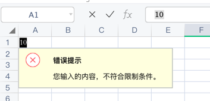

# 大于约束

## 示例

单元格数据验证类型为`整数`，约束条件为`大于`，值为`20`。所以单元格`A1`的值必须为整数，并且要大于20。

```php
$config = [
    'path' => './'
];

$validation = new \Vtiful\Kernel\Validation();
$validation->validationType(\Vtiful\Kernel\Validation::TYPE_INTEGER)
    ->criteriaType(\Vtiful\Kernel\Validation::CRITERIA_GREATER_THAN)
    ->valueNumber(20);

$excel    = new \Vtiful\Kernel\Excel($config);
$filePath = $excel->fileName('tutorial.xlsx')
    ->validation('A1', $validation->toResource())
    ->insertText(0, 0, 21) // 不符合约束，并不会写入失败，打开文件时单元格旁边将会出现数据错误提示
    ->output();
```

