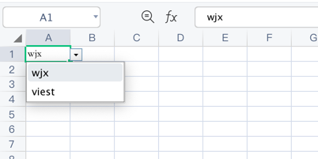

# 下拉列表

## 示例

```php
$config = [
    'path' => './'
];

$validation = new \Vtiful\Kernel\Validation();
$validation->validationType(\Vtiful\Kernel\Validation::TYPE_LIST)
    ->valueList(['wjx', 'viest']);

$excel    = new \Vtiful\Kernel\Excel($config);
$filePath = $excel->fileName('tutorial.xlsx')
    ->validation('A1', $validation->toResource())
    ->output();
```

